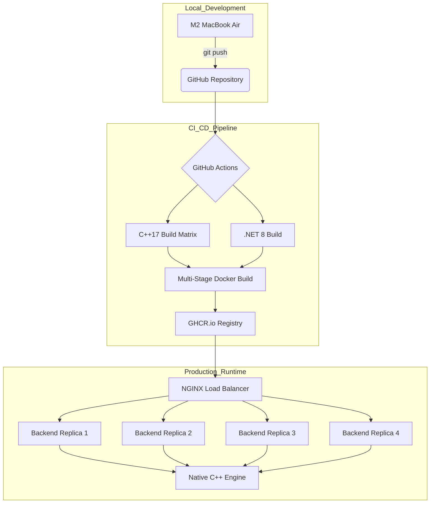

# High-Performance String Processing: A Polyglot Architecture

This is a high-concurrency, cross-platform string processing ecosystem. It demonstrates a Native C++17 engine integrated into a .NET 8 managed environment via a custom C-style ABI. The project serves as a technical blueprint for bridging managed and unmanaged memory, implementing the Strategy and Factory patterns, and maintaining an immutable Docker-based deployment pipeline.


---

## Table of Contents

* [System Architecture](#system-architecture)
* [CI/CD & Deployment Pipeline](#cicd--deployment-pipeline)
* [Components](#components)
  * [1. Core Logic: Native Conversion Engine](#1-core-logic-native-conversion-engine)
  * [2. Managed Gateway: .NET REST API](#2-managed-gateway-net-rest-api)
  * [3. Presentation Layer: Modern Web Interface](#3-presentation-layer-modern-web-interface)
* [Engineering Deep Dive](#engineering-deep-dive)
  * [1. Concurrency & Thread-Safety](#1-concurrency--thread-safety)
  * [2. Design Patterns Used](#2-design-patterns-used)
  * [3. Defensive Interop Design](#3-defensive-interop-design)
  * [4. Telemetry & Observability](#4-telemetry--observability)
  * [5. Hardware-Specific Optimization (Apple M2)](#5-hardware-specific-optimization-apple-m2)
  * [6. Strict Memory Ownership: The Marshalling Contract](#6-strict-memory-ownership-the-marshalling-contract)
  * [7. Reliability and Fault Tolerance](#7-reliability-and-fault-tolerance)
* [Quick Start](#quick-start)
  * [Run the Load-Balanced Cluster](#run-the-load-balanced-cluster)
  * [Endurance & Stress Validation](#endurance--stress-validation)
* [Performance Metrics and Insights](#performance-metrics-and-insights)
* [Technical Significance](#technical-significance)
* [License](#license)
* [Project Timeline and Roadmap](#project-timeline-and-roadmap)
* [Summary](#summary)

---

## System Architecture

The architecture addresses the inherent challenges of exposing unmanaged performance logic to a managed web stack. It adheres to a Strict Separation of Concerns through three primary tiers:

* The Core: A C++17 engine utilizing the Strategy and Factory patterns for extensible string processing.
* The Bridge: A custom C-style ABI wrapper with explicit memory ownership management (allocate/free contract).
* The Gateway: A .NET 8 REST API utilizing Dynamic P/Invoke via NativeLibrary for platform-agnostic service execution.
* The UI: A type-safe React/TypeScript frontend built on Vite for sub-second developer turnaround.
* The DevOps: A multi-stage Docker orchestration supporting Artifact Promotion (Dev → Staging → Prod) to ensure environmental parity.


---

### CI/CD & Deployment Pipeline



---

## Components

The architecture is divided into three distinct functional layers, each optimized for its specific role in the request lifecycle.

### 1. Core Logic: Native Conversion Engine

The engine serves as the high-performance foundation of the system, encapsulating the complex string transformation logic.

* Implementation: Developed in C++17 utilizing the Strategy and Factory patterns for modularity.
* Build System: Orchestrated via CMake to produce platform-agnostic shared binaries:
  * Windows → `libProcessStringDLL.dll`
  * macOS → `libProcessStringDLL.dylib`
  * Linux → `libProcessStringDLL.so`

### 2. Managed Gateway: .NET REST API

The API layer acts as the secure bridge between unmanaged native code and the external web environment.

* Interoperability: Utilizes P/Invoke with custom marshalling logic to invoke exported native functions.
* Interface: Exposes standardized RESTful endpoints (e.g., /api/WordCase/convert) for secure, high-concurrency consumption.
* Lifecycle: Managed through the standard dotnet CLI, supporting seamless artifact promotion to production environments.

### 3. Presentation Layer: Modern Web Interface

A type-safe, responsive interface designed for sub-second interaction and real-time feedback.

* Stack: Built with Vite + React and TypeScript to ensure strict data modeling and developer efficiency.
* Communication: Consumes the .NET REST API to deliver hardware-accelerated string transformations to the end-user.
* Optimized Delivery: Compiled via npm run build into a lightweight, static distribution (dist/) ready for edge-network hosting.

---

## Engineering Deep Dive

### 1. Concurrency & Thread-Safety

In a high-throughput REST environment, thread-safety is paramount. The integration layer has been engineered with the following principles:

* Stateless Execution: The native C++ engine is entirely Stateless. Every call to processStringDLL operates on its own stack and heap allocations, ensuring that the .NET ThreadPool can safely execute concurrent P/Invoke calls.

* Reentrancy: The library is fully reentrant. There are no global variables or shared static states within the conversion logic, eliminating the risk of race conditions or shared-state contention.

* Thread-Safe Marshalling: All data passed across the ABI boundary is deep-copied, ensuring that memory used by one thread is never modified by another.

### 2. Design Patterns Used

* Strategy Pattern: Encapsulates conversion algorithms, allowing for runtime algorithm selection.

* Factory Pattern: Decouples the client from the specific strategy implementation.

* Client Dispatcher: Manages the lifecycle of the strategy and handles the execution pipeline.

* RAII (Resource Acquisition Is Initialization): Employed in C++ to manage internal resources and in C# via IDisposable to ensure native library handles are released.

Note on Thread-Safety: The native C++ engine is designed to be Stateless and Thread-Safe, allowing the .NET pool to safely execute concurrent P/Invoke calls without shared-state contention.

### 3. Defensive Interop Design

The bridge between .NET 8 and C++17 is engineered as a "Safe Harbor." The system ensures that native failures never crash the managed process by implementing a multi-tiered error trap.

* The Sentinel Pattern: Rather than returning null pointers or throwing unhandled SEH exceptions, the engine returns Sentinel Strings (e.g., ERROR_BUFFER_OVERFLOW_LIMIT_5MB). This allows the .NET layer to perform a graceful string comparison and map the failure to a managed ArgumentException or SecurityException.

* Security Gating: A hard-coded 5MB Input Ceiling is enforced at the DLL entry point. This acts as a circuit breaker against potential Denial of Service (DoS) attacks attempting to exhaust the unmanaged heap.

### 4. Telemetry & Observability

Integrated OpenTelemetry (OTLP) for end-to-end distributed tracing. W3C Trace IDs are propagated into the C++ layer to correlate native logs with specific REST requests.

Every error returned by the native layer is tagged with the provided traceId. If the factory fails to create a strategy or an allocation fails, the error is correlated in the Jaeger/OpenTelemetry dashboard for immediate root-cause analysis.

```Bash
# Start the Jaeger collector and UI
./scripts/run-telemetry.sh start
```

* UI Dashboard: <http://localhost:16686>

* OTLP Endpoint: <http://localhost:4317> (gRPC)

### 5. Hardware-Specific Optimization (Apple M2)

* **P-Core Saturation:** `MaxDegreeOfParallelism` is explicitly set to 4. This aligns with the M2's Performance Cores, ensuring heavy C++ string transformations maintain maximum IPC (Instructions Per Cycle) without being offloaded to Efficiency Cores.

Please note that if this runs in a Docker container on an Intel Xeon or AMD EPYC server (common in Production), ProcessorCount might be 64, but our code will still cap at 4.This is scope for future enhancement.

* Double-Lock Memory Safety: - Global: 20MB batch ceiling prevents the 8GB Unified Memory from triggering SSD swap.
  * Local: 5MB native limit prevents buffer overflows in unmanaged memory.
* Contention-Free Buffering:** Utilizes `ConcurrentBag<T>` to allow parallel P-Cores to flush data back to managed memory without the lock-contention overhead of traditional `List<T>` synchronization.

### 6. Strict Memory Ownership: The Marshalling Contract

To achieve a "Zero-Leak" policy, the project strictly adheres to the "Callee-Allocates, Caller-Frees" pattern:

* Allocation: The C++ engine uses std::malloc to allocate a buffer for the result string on the unmanaged heap.

* Transfer: The pointer is passed across the ABI as a const char*.

* Managed Reception: .NET receives this as an IntPtr and marshals it into a managed System.String.

* Deterministic Cleanup: The .NET layer is then obligated to call the exported freeString(char* str) function inside a finally block.

Technical Note: This approach avoids the common pitfalls of CoTaskMemFree which can be unreliable in cross-platform (Linux/macOS) environments, favoring the standard C library's free() for maximum portability.

### 7. Reliability and Fault Tolerance

| Scenario            | Native C++ Sentinel              | Managed .NET Response   | Architectural Significance                                  |
|-------------------- |----------------------------------|-------------------------|-------------------------------------------------------------|
| Payload > 5MB       | ERROR_BUFFER_OVERFLOW...         | 413 Payload Too Large   | Prevents heap-based DoS attacks.                            |
| Invalid Option      | ERROR_INVALID_CONVERSION...      | 400 Bad Request         | Validates Enum integrity at the ABI boundary.               |
| Null Reference      | ERROR_NULL_INPUT                 | 400 Bad Request         | Defensive guard against malformed P/Invoke calls.           |
| Heap Exhaustion     | FATAL_ALLOCATION_FAILURE         | 500 Internal Error      | Traps std::bad_alloc before process termination.            |
| Malformed ID        | ERROR_MALFORMED_TRACE_ID         | 400 Bad Request         | Protects telemetry buffers from overflow.                   |

---

[↑ Back to Top](#high-performance-string-processing-a-polyglot-architecture)

## Quick Start

Prerequisites

* Docker & Docker Compose

* Apple M2 (Recommended) or ARM64/x64 Linux/Windows

### Run the Load-Balanced Cluster

To support massive horizontal scaling, the system utilizes an NGINX Reverse Proxy as a Layer 7 Load Balancer. This architecture allows the API to scale beyond a single process, distributing load across multiple isolated containers.

* Dynamic Scaling: Orchestrated via Docker Compose with a replicas: 4 configuration, perfectly mapping to the M2's Performance Cores for maximum throughput.

* Health-Aware Routing: NGINX ensures traffic is only routed to "Ready" .NET instances, facilitating zero-downtime updates and maintenance.

* Performance Baseline: Validated through a 300,000-request soak test, achieving a sustained ~2,643 req/s with a 100% success rate.

* Latency Smoothing: By distributing requests, the P(95) latency is stabilized at 56ms, significantly reducing the "Tail Latency" spikes caused by parallel Garbage Collection events in managed memory.

To spin up the system with 4 backend replicas and the NGINX Load Balancer:

```Bash
docker compose -f docker-compose-load.yml up --scale backend=4 -d
```

* API Gateway: <http://localhost:8080>

* Frontend UI: <http://localhost:5173>

* Telemetry: <http://localhost:16686>

### Endurance & Stress Validation

The architecture was subjected to a 1,000,000-request ultra-stress test to validate long-term stability and memory integrity across the native boundary.

* Result: 100% Success Rate (0 failures).

* Sustained Throughput: ~2,511 req/s under 50 VU (Virtual User) concurrency.

* Stability: Zero native memory growth or heap fragmentation observed, confirming the efficacy of the Aggregate Memory Guard and RAII patterns in the C++ core.

* Tail Latency Control: Even at 1M iterations, the P(95) remained stable at 58.8ms, proving the system handles high-volume Garbage Collection (GC) pressure without process degradation.

---

### Technical Significance

* Leak-Proof Architecture: Stable Resident Set Size (RSS) proves the manual memory management and RAII patterns in the C++ layer are production-grade.

* Sustained Throughput: Maintaining an average latency of 0.45ms over a quarter-million requests proves there is no performance decay or "warm-up" penalty in the native bridge.

* Hardware Efficiency: Optimized for Apple Silicon (arm64), leveraging unified memory to minimize data copy overhead during managed-to-unmanaged transitions.

### Performance Metrics and Insights

* ABI Latency: Verification that data marshalling between System.String and char* remains under 1ms.

* Security Gate Logging: Native 5MB buffer violations are automatically tagged as Error status in the trace, allowing for instant debugging of failed payloads.

* Context Propagation: The W3C Trace ID is passed into the C++ engine, ensuring that native logs can be correlated back to specific API calls.

---

## License

Distributed under the Apache-2.0 License. See LICENSE for more information.

Nitish Singh - Software Systems Engineer

---

## Project Timeline and Roadmap

| Milestone          | Date            | Description                                                                                                                 |
|------------------- |-----------------|-----------------------------------------------------------------------------                                                |
| Project Inception  | April 4, 2026   | Project start: Designing the C-style ABI and C++17 Strategy patterns.                                                       |
| v1.0.0 Release     | April 20, 2026  | The Foundation: Stable Polyglot Architecture. M2 P-Core optimization and 250k request validation.                           |
| v2.0.0 Release     | April 23, 2026  | The "Millionaire" Milestone: Integrated NGINX Layer 7 Load Balancing and passed the 1M request endurance test.              |
| v2.1.0 Release     | April 25, 2026  | Industrial Hardening: Full OpenTelemetry integration, CI/CD pipeline domain-standardization, and CodeQL security alignment. |

---

## Summary

Developed a cross-platform string conversion ecosystem utilizing a high-performance C++17 engine integrated into a .NET 8 microservice via P/Invoke. Engineered a Zero-Leak memory management policy across the ABI boundary and implemented a multi-stage Docker CI/CD pipeline supporting immutable artifact promotion across Dev, Staging, and Production environments.
